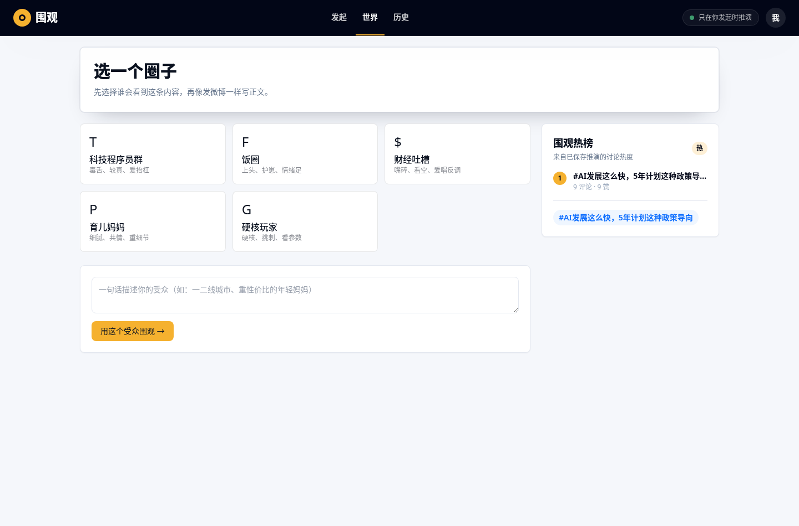
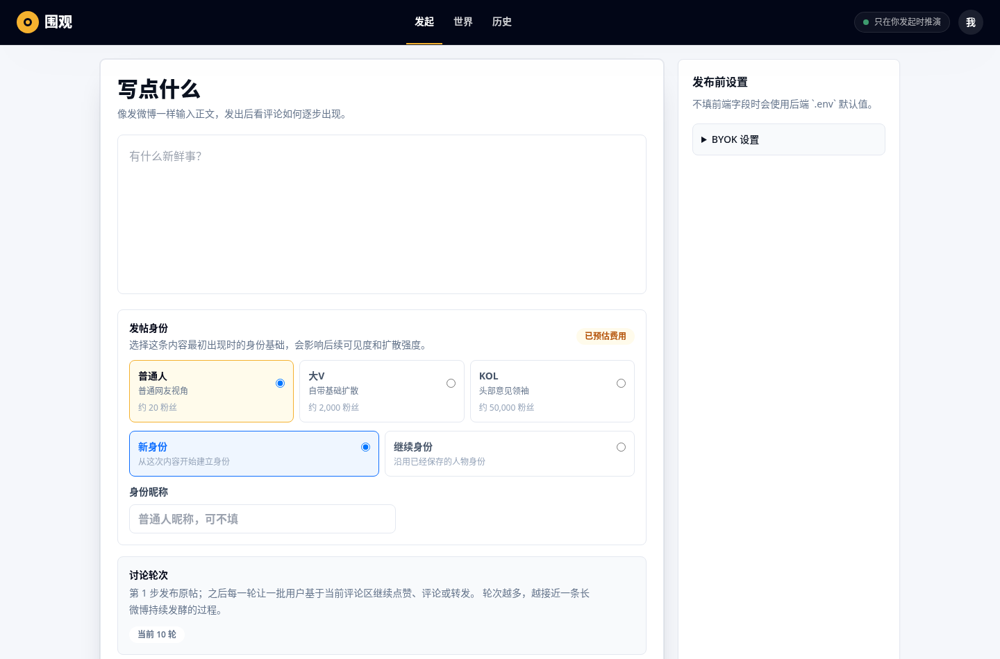
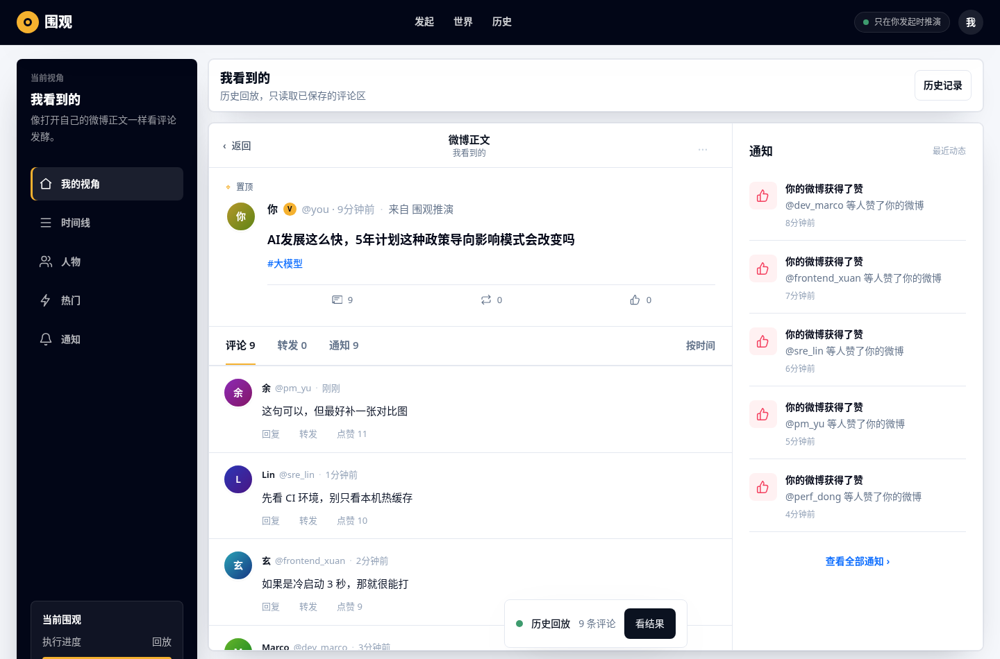
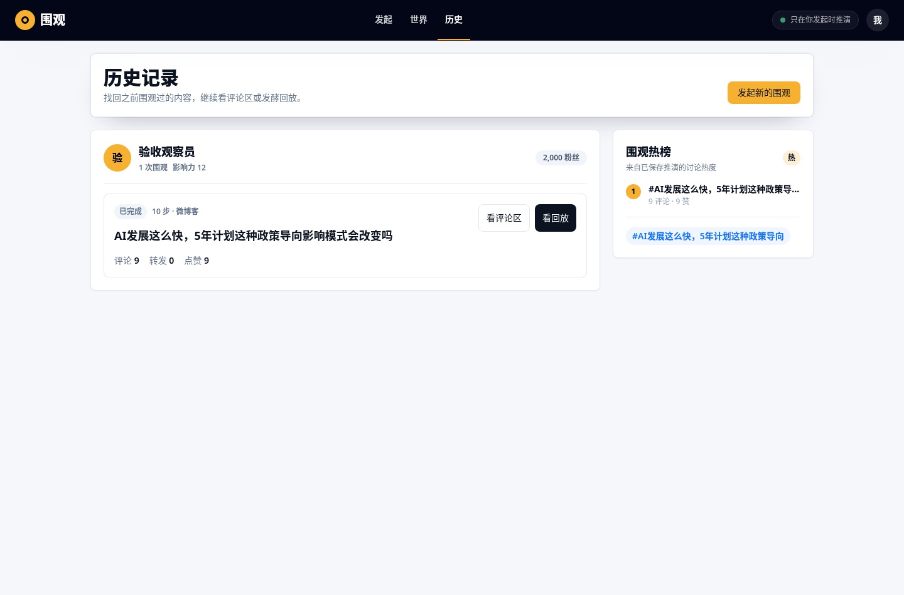
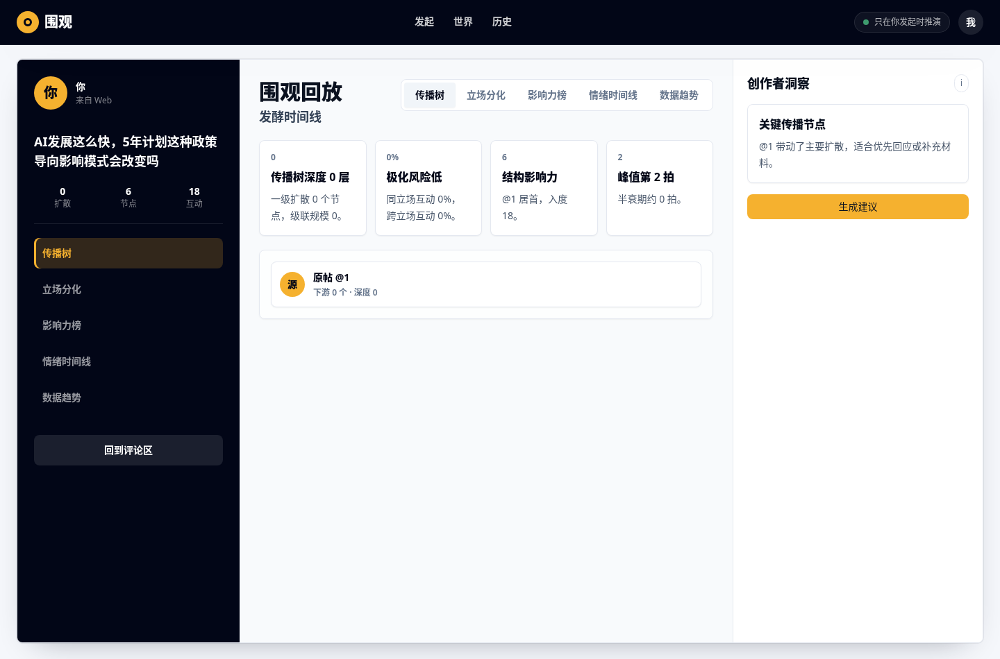
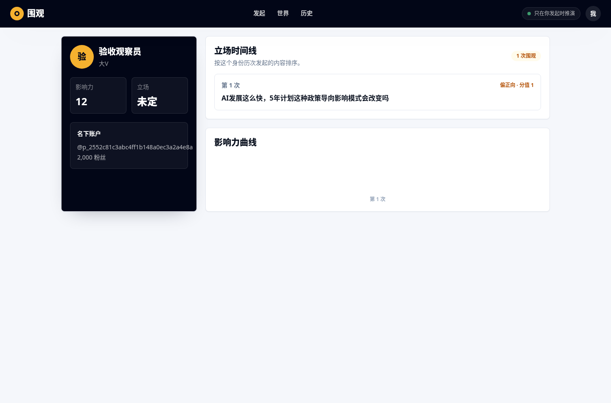

# 围观最新版功能验收手册

版本日期：2026-07-03  
参考提交：`e0a3310`  
截图来源：本地 `FakeEngine` 演示后端，仅用于页面定位和交互说明；真实验收以你的实际 OASIS/LLM run 数据为准。

## 1. 验收前准备

### 1.1 启动后端

在 `backend` 目录启动：

```bash
cd backend
/home/sunrise/.virtualenvs/my-oasis-backend/bin/python -m uvicorn weiguan.api.main:app --host 127.0.0.1 --port 8000
```

后端默认从 `backend/.env` 读取 LLM 配置。前端 BYOK 表单不填时，会使用后端 `.env` 默认值。

常用 `.env` 示例：

```bash
WEIGUAN_LLM_KEY=<你的 key>
WEIGUAN_LLM_BASE_URL=http://127.0.0.1:8001/v1
WEIGUAN_LLM_MODEL=zbnsec-default
WEIGUAN_LLM_REASONING_EFFORT=
WEIGUAN_LLM_THINKING=

WEIGUAN_LLM_MAX_AGENTS=4
WEIGUAN_LLM_MAX_STEPS=
WEIGUAN_LLM_ERROR_THRESHOLD=1
WEIGUAN_LLM_MAX_RETRIES=0
WEIGUAN_LLM_MAX_TOKENS=256
WEIGUAN_LLM_COST_BUDGET_RMB=5
```

验收要点：

- `WEIGUAN_LLM_BASE_URL` 对 vLLM/OpenAI-compatible 服务通常要包含 `/v1`。
- `WEIGUAN_LLM_MAX_STEPS=` 留空表示不做硬轮次截断；成本安全由并发、agent 数、上下文窗口、输出上限和预算估算控制。
- 如果使用 reasoning 模型但只返回 reasoning、不返回 content，先把 `WEIGUAN_LLM_REASONING_EFFORT` 和 `WEIGUAN_LLM_THINKING` 留空，并确认 `WEIGUAN_LLM_MAX_TOKENS` 足够。

### 1.2 启动前端

在 `frontend` 目录启动：

```bash
cd frontend
npm run dev -- --host 0.0.0.0
```

Vite dev server 会把 `/api` 代理到 `http://127.0.0.1:8000`。

### 1.3 基础连通验收

```bash
curl -s http://127.0.0.1:8000/api/crowds
curl -s http://127.0.0.1:8000/api/runs
```

预期：

- `/api/crowds` 返回圈子数组。
- `/api/runs` 返回历史 run 数组；没有历史时是空数组，不应 500。

## 2. 发起页：选圈子与热榜



入口：顶部导航 `世界`，或访问 `/`。

功能说明：

- 左侧是预设圈子：科技程序员群、饭圈、财经吐槽、育儿妈妈、硬核玩家。
- 下方支持自定义受众，用一句话描述谁会看到这条内容。
- 右侧 `围观热榜` 来自已保存 run 的讨论热度，不是静态假数据。

验收步骤：

1. 打开首页。
2. 确认圈子卡片能加载；后端未启动时应显示“圈子加载失败”和重试按钮。
3. 点击任一圈子，进入发起页。
4. 回到首页，输入自定义受众，点击 `用这个受众围观`，也应进入发起页。
5. 做过真实推演后刷新首页，确认热榜展示历史 run 的标题、评论数和点赞数。

预期结果：

- 预设圈子点击后，发起页的 audience 使用 `crowd_id`。
- 自定义受众点击后，发起页的 audience 使用 `custom`。
- 热榜为空时不报错；有历史数据时展示真实历史 run 摘要。

## 3. 发起页：正文、身份、轮次和 BYOK



入口：顶部导航 `发起`，或从首页圈子进入。

功能说明：

- 正文输入：像发微博一样填写 seed 内容。
- 发帖身份：普通人、大V、KOL。身份会影响初始可见度和后续扩散强度。
- 身份模式：可以创建新身份，也可以继续已有身份。
- 讨论轮次：快速围观 6 轮、标准 10 轮、深度发酵 15 轮，也支持自定义 1-1000 轮。
- 发布前设置：BYOK 可覆盖后端 `.env` 默认值；不填则走后端默认。
- 成本预估：前端会调用 `/api/runs/preview-cost`，展示后端基于安全参数估算的结果。

验收步骤：

1. 输入正文，例如：`AI发展这么快，5年计划这种政策导向影响模式会改变吗`。
2. 选择一个身份基础，例如 `大V`。
3. 选择 `新身份` 并填写昵称，或选择 `继续身份` 复用历史身份。
4. 选择 6/10/15 轮，或选择自定义轮次并输入 1-1000。
5. 展开 BYOK 设置：
   - 不填：使用后端 `.env`。
   - 填写：请求头携带 `X-LLM-Key`、`X-LLM-Model`、`X-LLM-Base-Url` 等覆盖值。
6. 点击 `开始围观`。

预期结果：

- 参数合法时跳转到 `/run/{run_id}/live`。
- 自定义轮次超过 1000 时前端应钳制或后端拒绝；后端 schema 允许范围是 1-1000。
- 后端 `.env` 缺少 key 且前端 BYOK 也为空时，接口返回 `401 missing X-LLM-Key`。
- 若模型连接错误，应显示可理解的错误，而不是页面静默无响应。

## 4. 实时评论区：第一人称微博视角



入口：发起成功后进入 `/run/{run_id}/live`；历史回放入口是 `/run/{run_id}/live?replay=1`。

功能说明：

- 主区域模拟微博正文页：置顶原帖、评论、转发、通知。
- 左侧是视角切换：我的视角、时间线、人物、热门、通知。
- 右侧通知展示点赞等事件。
- 底部状态条只保留当前状态、评论数和 `看结果`。
- 历史回放不会重新触发推演，只读取已保存 snapshot。

验收步骤：

1. 新建一次 run，进入 live 页。
2. 观察原帖应立即显示用户输入的 seed 正文，不应等 LLM 首次返回才出现。
3. 推演过程中，评论数、通知数、进度逐步变化。
4. 刷新当前 live 页，应继续消费同一个 run 的状态，不应创建新 run。
5. 另开一个浏览器标签打开同一个 live URL，应只作为视图消费者读取同一个 run，不应重启逻辑层。
6. run 完成后点击 `看结果`，进入复盘页。
7. 从历史页点击 `看评论区`，URL 应带 `?replay=1`，且只读取历史数据。

预期结果：

- 评论按真实社交信息流习惯展示，较新的评论优先可见。
- 时间显示应基于后端事件时间或推演时间，显示为“刚刚 / X 分钟前 / X 小时前”等相对时间。
- replay 模式状态文案为“历史回放”，不会再次调用 OASIS/LLM。
- 同一个 run 多个页面同时观看时，步数不应回退、不应重复生成相同批次。

常见失败信号：

- 新开一个 live 页面后评论区为空，而原页面有数据：说明视图订阅没有正确读取已有 snapshot。
- 历史进入评论区又开始推演：说明 replay 和 live 逻辑混用。
- 步数回退或评论数和步数明显错乱：说明 run 状态、SSE 或前端快照合并有问题。

## 5. 历史记录：找回已保存 run



入口：顶部导航 `历史`。

功能说明：

- 历史按发帖身份分组。
- 每条 run 展示状态、步数、平台、正文、评论/转发/点赞统计。
- `看评论区` 进入 replay 评论区。
- `看回放` 进入复盘页。
- 右侧热榜复用历史 run 的真实统计。

验收步骤：

1. 完成一次真实 run。
2. 重启后端和前端。
3. 打开历史页。
4. 点击 `看评论区`。
5. 返回历史页，点击 `看回放`。

预期结果：

- 重启后历史仍存在，说明数据从后端 store 恢复，不是前端内存 mock。
- `看评论区` 不触发新推演。
- `看回放` 能基于已保存 snapshot 计算分析。

常见失败信号：

- 重启服务后历史消失：检查后端 store 目录和启动工作目录是否一致。
- 历史卡片显示数据和评论区 totals 不一致：检查 `_run_summary`、`compute_metrics` 和前端映射。

## 6. 发酵复盘：传播、立场、影响力、时间线



入口：live 页点击 `看结果`，或历史页点击 `看回放`。

功能说明：

- 左侧是本次内容和统计摘要。
- 中间是复盘主视图，支持：
  - 传播树
  - 立场分化
  - 影响力榜
  - 情绪时间线
  - 数据趋势
- 右侧是创作者洞察和建议。
- `生成建议` 会调用 LLM，生成后应持久化；刷新页面后仍可看到，并可重新生成。

验收步骤：

1. 进入某个已完成 run 的复盘页。
2. 切换每个分析 tab。
3. 点击 `生成建议`。
4. 刷新页面。
5. 点击 `重新生成建议`。

预期结果：

- 每个 tab 的产品含义清楚：不是单纯按颜色过滤卡片，而是展示对应分析投影。
- 没有数据的分析视图应显示空状态，不应伪造结果。
- 建议刷新后仍存在，重新生成会更新持久化内容。
- 生成建议需要 LLM key；如果 key 不可用，应显示错误并且不影响已有复盘数据。

## 7. 身份页：同一个“我”的长期视角



入口：顶部右侧 `我`，或 `/identity/{person_id}?world_id={world_id}`。

功能说明：

- 展示身份昵称、身份类型、账号 handle、粉丝数。
- 立场时间线按该身份历次发起内容排序。
- 影响力曲线展示跨 run 的变化趋势。

验收步骤：

1. 发起页选择 `新身份`，完成一次 run。
2. 再次发起，选择 `继续身份`，用同一身份完成第二次 run。
3. 点击顶部右侧 `我`。

预期结果：

- 同一身份下能看到多次 run。
- 立场时间线按 run 顺序排列。
- 影响力曲线随多次 run 逐渐有数据。
- 切换浏览器或清空 localStorage 后，仍可通过历史页进入对应身份数据；不能只依赖前端内存。

## 8. 人物追问

入口：live 页点击评论作者，打开人物视角/追问抽屉。

功能说明：

- 只能追问真实参与过 seed 互动的 actor。
- 追问基于同一次 run 的 seed 原文、该 actor 对 seed 的真实评论/动作、人设和用户问题生成。
- 追问不会删除或重建 `run.db`，不会改变历史 snapshot。

验收步骤：

1. 完成一次真实 run。
2. 在评论区点击参与过 seed 的评论者。
3. 输入追问，例如：`你为什么这么判断？`。
4. 提交追问。
5. 对一个未参与 seed 的 actor 调接口或构造请求。

预期结果：

- 参与过 seed 的 actor 返回非空回答。
- 未参与 actor 返回 404。
- 追问后 run 仍可复盘，snapshot totals 不变。

## 9. 多平台世界

入口：顶部导航 `世界` 当前主要承载选圈子和热榜；代码中已有 `/world/{world_id}/live` 展示组件。

当前状态：

- 多平台展示组件支持微博/Reddit 栏、桥接路径、世界时钟。
- 组件级能力已存在。
- 当前路由没有主动从后端拉取 world frames，所以直接访问 `/world/{id}/live` 还不能作为完整可验收用户路径。

验收建议：

1. 设计者下一轮明确世界页入口和用户路径。
2. 前端路由接线 `/api/worlds/{world_id}` 或 `/api/runs/{run_id}/frames`。
3. 后端保证 `bridge_inject`、平台事件、run frames 持久化。
4. 完成后补一张多平台 live 截图进本手册。

## 10. 成本安全与性能验收

当前成本安全设计不是简单砍轮次，而是组合约束：

- bounded attention context：每个 agent 只看有限、相关、可解释的上下文。
- `WEIGUAN_LLM_MAX_AGENTS`：限制参与 LLM 决策的 agent 数。
- `WEIGUAN_ATTENTION_COMMENT_BUDGET`：限制每轮可见评论预算。
- `WEIGUAN_LLM_MAX_TOKENS`：限制单次输出。
- `WEIGUAN_LLM_COST_BUDGET_RMB`：用于预算估算和 agent 数收缩。
- `WEIGUAN_OASIS_LLM_SEMAPHORE`：限制 OASIS LLM 并发。
- `WEIGUAN_LLM_MAX_RETRIES=0`：默认不让 provider retry 放大成本。
- `WEIGUAN_LLM_MAX_STEPS=`：默认关闭硬截断；只有显式设置时才作为运维级熔断。

验收步骤：

```bash
curl -s "http://127.0.0.1:8000/api/runs/preview-cost?steps=500&llm_max_agents=4&attention_comment_budget=12&person_memory_budget=4"
```

预期结果：

- 返回 `estimated_rmb`、`budgeted_agents`、`decision_steps`。
- 自定义 500/1000 轮时，前端可提交，后端不会 schema 拒绝。
- 真实运行时不应出现输入 token 随轮次平方级爆炸。

## 11. 推荐验收命令

非 LLM 回归：

```bash
cd backend
/home/sunrise/.virtualenvs/my-oasis-backend/bin/python -m pytest -m "not llm and not llm_effect" -q
cd ../frontend
npx vitest run
npx tsc -b
```

LLM 连通性：

```bash
cd backend
/home/sunrise/.virtualenvs/my-oasis-backend/bin/python -m pytest tests/api/test_llm_connectivity.py -q
```

真实 LLM/OASIS 验收只在你确认预算后执行：

```bash
cd backend
WEIGUAN_TEST_LLM_BASE_URL=<base_url> \
WEIGUAN_TEST_LLM_MODEL=<model> \
/home/sunrise/.virtualenvs/my-oasis-backend/bin/python -m pytest -m "llm and not llm_effect" -v

WEIGUAN_TEST_LLM_BASE_URL=<base_url> \
WEIGUAN_TEST_LLM_MODEL=<model> \
/home/sunrise/.virtualenvs/my-oasis-backend/bin/python -m pytest -m llm_effect -v
```

注意：不要让审核者自行跑需要 key 的测试。需要 LLM key 的测试由你执行，或由审核者采信你提供的输出。

## 12. 总验收清单

- [ ] 首页圈子可加载，失败态可见。
- [ ] 热榜来自历史 run，不是 mock。
- [ ] 发起页 BYOK 可覆盖后端 `.env`，不填使用 `.env`。
- [ ] 新身份和继续身份都能创建 run。
- [ ] 自定义轮次 1-1000 可提交，非法值被拦截。
- [ ] live 初始状态立即展示 seed 正文和合理进度。
- [ ] live 多消费者不会重启同一个 run。
- [ ] replay 只读历史，不触发推演。
- [ ] 评论、通知、历史 totals 口径一致。
- [ ] 评论时间显示来自后端时间链路，而不是永远“刚刚”。
- [ ] 历史重启后仍存在。
- [ ] 复盘 tab 有明确业务含义，空状态不伪造数据。
- [ ] 建议可持久化，可重新生成。
- [ ] 人物追问只允许 seed 参与 actor。
- [ ] 成本预估接口可用，长轮次不会导致 token 二次方增长。
- [ ] 多平台世界路径当前如未接线，应作为后续规划项处理。
