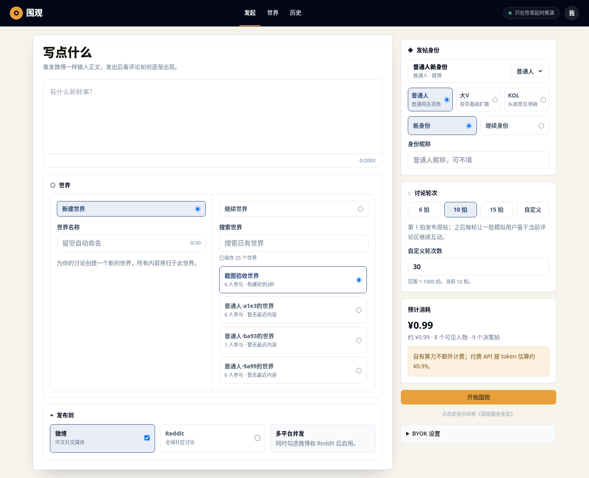
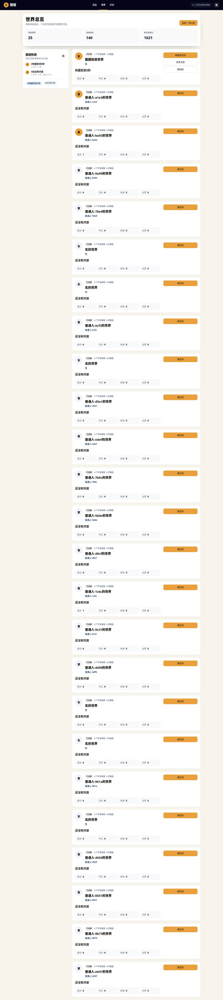
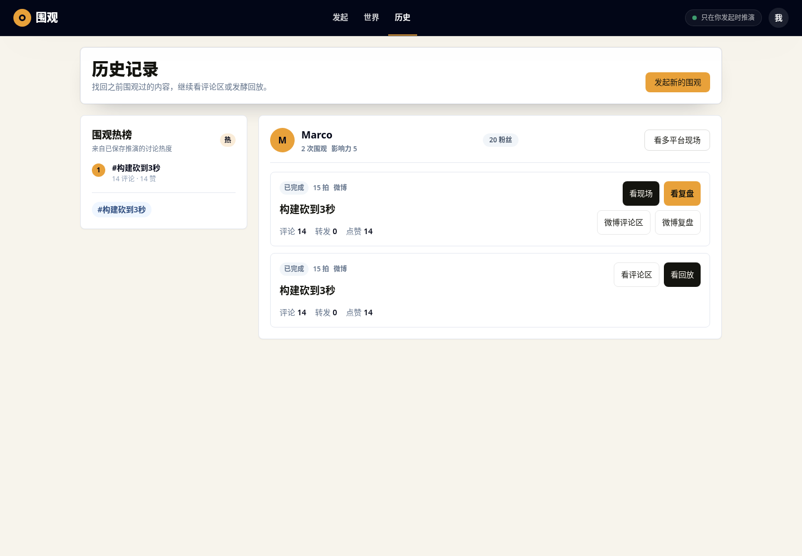
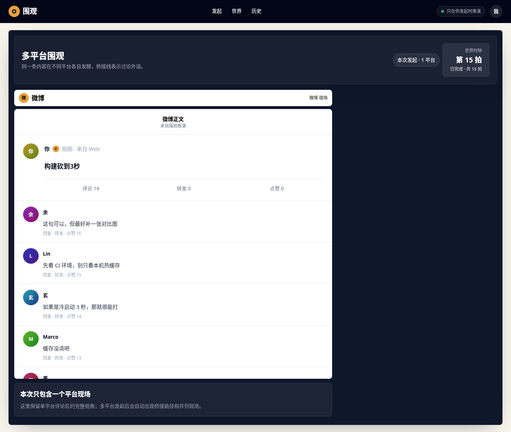

# 围观桌面高保真精修验收记录

日期：2026-07-07  
范围：按 P13/P14 原型调性对桌面版继续精修；移动端只确认不出现明显破版。

## 本轮目标

- 发起页按 P14 原型重排为“正文编辑 + 世界双栏 + 发布平台”左主卡，以及“发帖身份 + 讨论轮次 + 预计消耗 + 启动入口”右侧发起栈。
- 世界总览从管理列表感改为“左侧热榜 + 右侧世界卡片信息流”。
- 历史记录从右侧热榜改为 P13 方向的“左侧热榜 + 右侧记录流”。
- 多平台现场在单平台或缺平台时显示明确占位，避免右侧空白被误判为页面 bug。

## 截图环境

- 后端：`WEIGUAN_WORKDIR=/tmp/weiguan-manual-shot`
- 后端地址：`http://127.0.0.1:8000`
- 前端地址：`http://127.0.0.1:9000`
- 截图命令：`npx playwright screenshot --browser=chromium --channel=chrome --viewport-size=1440,1000 --full-page --wait-for-timeout=2500`
- 截图目录：`docs/manual/assets/2026-07-07-hifi-remediation/`

## 最新截图

| 页面 | 截图 | 对照原型 |
| --- | --- | --- |
| 发起页 |  | [P14 发起页世界选区](assets/2026-07-06-P14-prototypes/compose-world-selector-desktop-mobile.png) |
| 世界总览 |  | [P14 世界总览](assets/2026-07-06-P14-prototypes/world-overview-desktop-mobile.png) |
| 历史记录 |  | [P13 统一历史](assets/2026-07-06-P13-prototypes/unified-history-desktop-mobile.png) |
| 多平台/单平台现场 |  | [P13 多平台现场](assets/2026-07-06-P13-prototypes/multiplatform-live-desktop-mobile.png) |

## 自审结论

| 页面 | 当前判断 | 说明 |
| --- | --- | --- |
| 发起页 | 已按 P14 桌面骨架整改 | 左侧主卡已改为正文、世界双栏和发布平台；右侧 sticky 栈已收拢身份、轮次、费用和唯一启动按钮。与原型仍有轻微差异：图标使用代码原生符号，世界列表显示真实本地数据而非原型样例。 |
| 世界总览 | 结构已对齐，样例数据影响观感 | 已改为热榜侧栏 + 世界卡片；当前截图里大量空世界来自本地样例数据，不代表组件层级。后续设计审核应同时看有真实内容的数据集。 |
| 历史记录 | 结构更接近 P13 | 热榜回到左侧，记录流成为主视线；仍保留现有身份分组，避免破坏已落地的身份接线。 |
| 多平台现场 | 修复空白坏态 | 单平台数据会显示“本次只包含一个平台现场”；如果 URL 包含另一个平台 run 但事件未到，会出现明确的缺平台占位。 |

## 自动化验证

```bash
cd frontend
npm run test -- --run
npx tsc -b
```

结果：

- `27 passed / 164 tests`
- `npx tsc -b` exit 0

新增/更新的桌面约束：

- `WorldOverviewScreen.test.tsx`：世界页必须使用 `lg:grid-cols-[300px_minmax(0,1fr)]` 的热榜 + 世界卡结构。
- `HistoryScreen.test.tsx`：历史页必须使用同方向的热榜 + 记录流结构。
- `MultiPlatformLiveScreen.test.tsx`：单平台和缺平台状态必须显示明确产品文案，不允许静默空白。
- `ComposeScreen.test.tsx`：发起页必须使用 P14 方向的 `lg:grid-cols-[minmax(0,1fr)_380px]` 双栏结构，世界选区必须为桌面双栏，右侧必须包含身份、轮次、预计消耗和启动按钮。

## 仍需设计者复核

- 世界总览在大量空世界数据下是否需要产品级过滤、归档或空世界折叠。
- 历史页是否继续保留“按身份分组”，还是下一步改为完全按发起时间的统一信息流。
- 多平台现场在只有一个平台数据时，是否应继续使用深色舞台，还是回退到单平台评论区风格。
