# 围观最新版验收手册

版本日期：2026-07-07  
适用范围：截至 `P14-T8` 之后的当前产品形态。覆盖发起、世界、历史、单平台评论区、多平台现场、身份页、复盘、入口接线、配色 token、性能观察和设计者审核清单。  
推荐数据目录：`WEIGUAN_WORKDIR=/tmp/weiguan-e2e`。  
LLM 注意：本文以只读验收和界面/接口接线为主；点击“开始围观”或“重新生成建议”会调用 LLM 或本地 OpenAI compatible 服务。

## 1. 当前版本结论

当前围观已经从早期“调试页面”收敛为社交产品心智：

- 顶层导航是 `发起 / 世界 / 历史`。
- 发起页负责写正文、选择平台、选择世界、选择发帖身份、设置讨论拍数、预估成本。
- 世界页是长期主题和持续身份入口。
- 历史页按一次“发起”组织记录，单平台和多平台都能继续进入现场或复盘。
- 单平台评论区像微博正文页，支持进行时和历史回放。
- 多平台现场并列展示微博与 Reddit，并区分“本次发起”和“世界全景”。
- 身份页可从世界、历史、评论区、多平台现场进入。
- 复盘页负责传播、立场、情绪、影响力、数据趋势和建议。

最新版相对 P14 的新增重点：

- `ComposeScreen` 选中态和提示框语义色已收敛到 design tokens。
- `bg-blue-50`、`bg-amber-50`、`text-amber-*`、`border-amber-*` 不再用于发起页语义色。
- 接线验收已制度化：新增/触及用户可达路径时必须列入口、目标、数据来源、无裸 ID 检查和自动化/人工验收方式。

## 2. 启动方式

### 2.1 后端

```bash
cd backend
WEIGUAN_WORKDIR=/tmp/weiguan-e2e \
  /home/sunrise/.virtualenvs/my-oasis-backend/bin/python -m uvicorn weiguan.api.main:app --host 127.0.0.1 --port 8000
```

`.env` 可放默认 LLM 配置。前端 BYOK 表单为空时使用 `.env` 默认值。

```dotenv
WEIGUAN_LLM_KEY=你的_key
WEIGUAN_LLM_BASE_URL=http://127.0.0.1:8000/v1
WEIGUAN_LLM_MODEL=你的模型名
WEIGUAN_LLM_REASONING_EFFORT=
WEIGUAN_LLM_THINKING=
WEIGUAN_WORKDIR=/tmp/weiguan-e2e
```

说明：

- 本地 vLLM / OpenAI compatible 服务通常需要 `/v1` 后缀。
- reasoning/thinking 对非 DeepSeek 或本地模型可能需要留空。
- 使用自有算力时，费用预估只是外部 API 口径提示，不代表本地实际扣费。

### 2.2 前端

```bash
cd frontend
npm run dev -- --host 0.0.0.0 --port 9000
```

常用入口：

- 发起：`http://127.0.0.1:9000/compose`
- 世界：`http://127.0.0.1:9000/worlds`
- 历史：`http://127.0.0.1:9000/history`
- 选圈子：首页 `/`

## 3. 自动化验收

不需要 LLM key：

```bash
cd backend
/home/sunrise/.virtualenvs/my-oasis-backend/bin/python -m pytest -m "not llm and not llm_effect" -q
```

```bash
cd frontend
npx vitest run
npx tsc -b
```

最近一次实现者验证结果：

- 后端：`215 passed, 3 skipped, 6 deselected`
- 前端：`162 passed`
- TypeScript：`exit 0`

发起页配色专项：

```bash
cd frontend
rg -n "bg-(blue|amber|emerald|rose|green|indigo|purple)-[0-9]|text-(blue|amber|emerald|rose|green)-[0-9]|border-(blue|amber)-[0-9]" src/screens/ComposeScreen.tsx
npx vitest run src/design/tokens.test.ts src/screens/ComposeScreen.test.tsx
```

最近一次结果：

- `rg`：零命中。
- token 对比度：`accent/accentSoft 7.58`，`warnInk/warnSoft 6.40`。
- `tokens.test.ts`：`8 passed`。
- `ComposeScreen.test.tsx`：`17 passed`。

## 4. 图片索引

当前状态截图：

- 选圈子：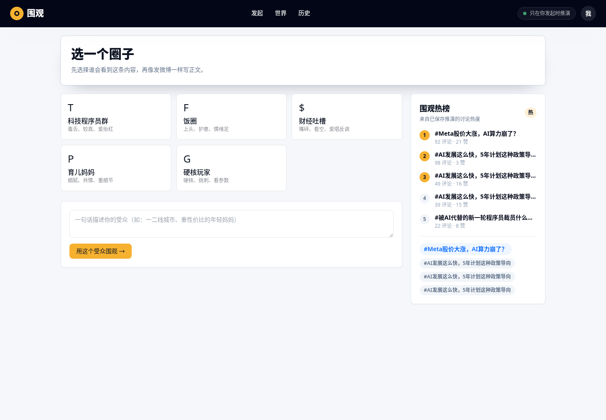
- 发起页：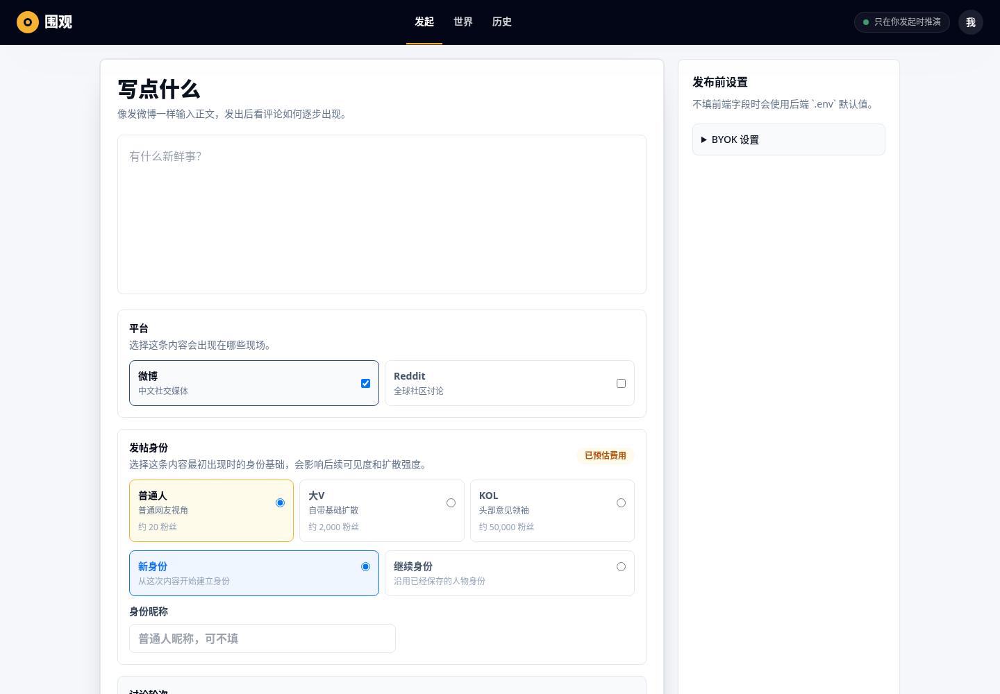
- 世界总览：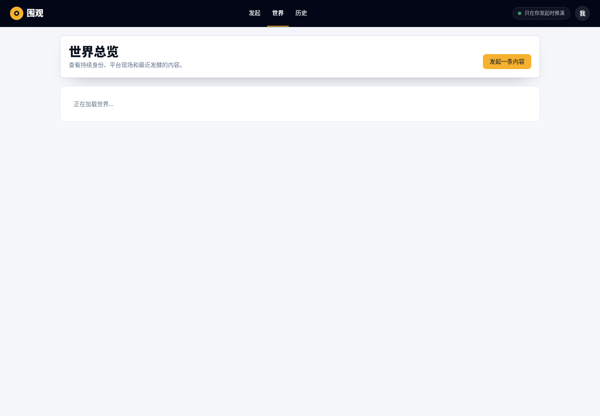
- 历史记录：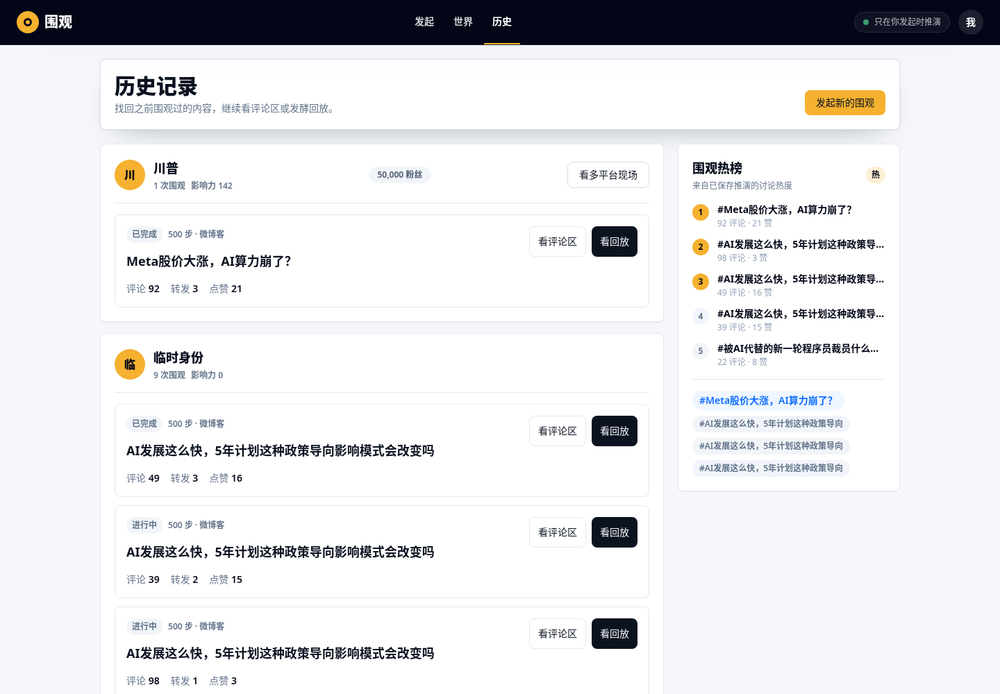
- 单平台评论区：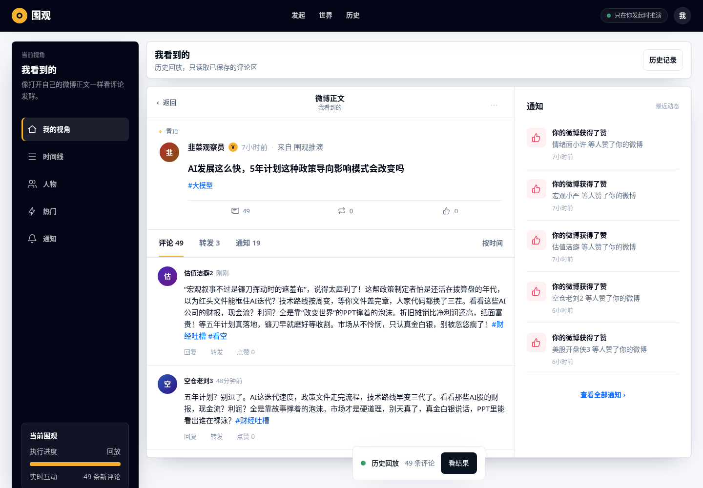
- 多平台现场：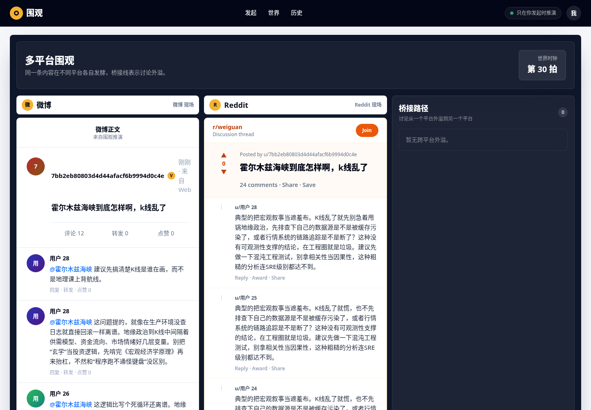
- 单 run 复盘：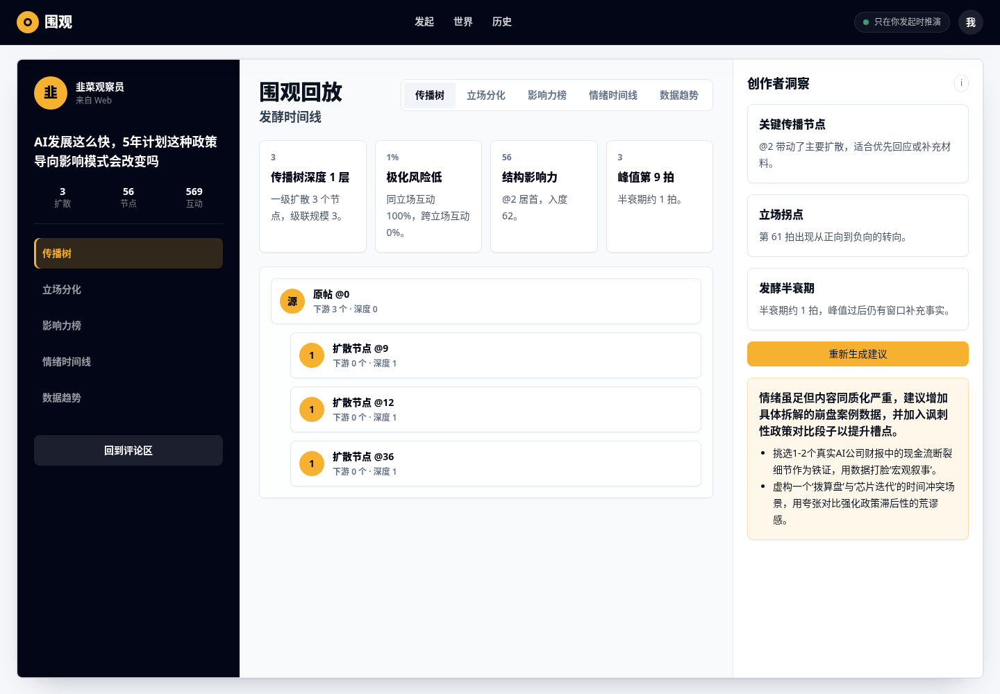
- 身份页：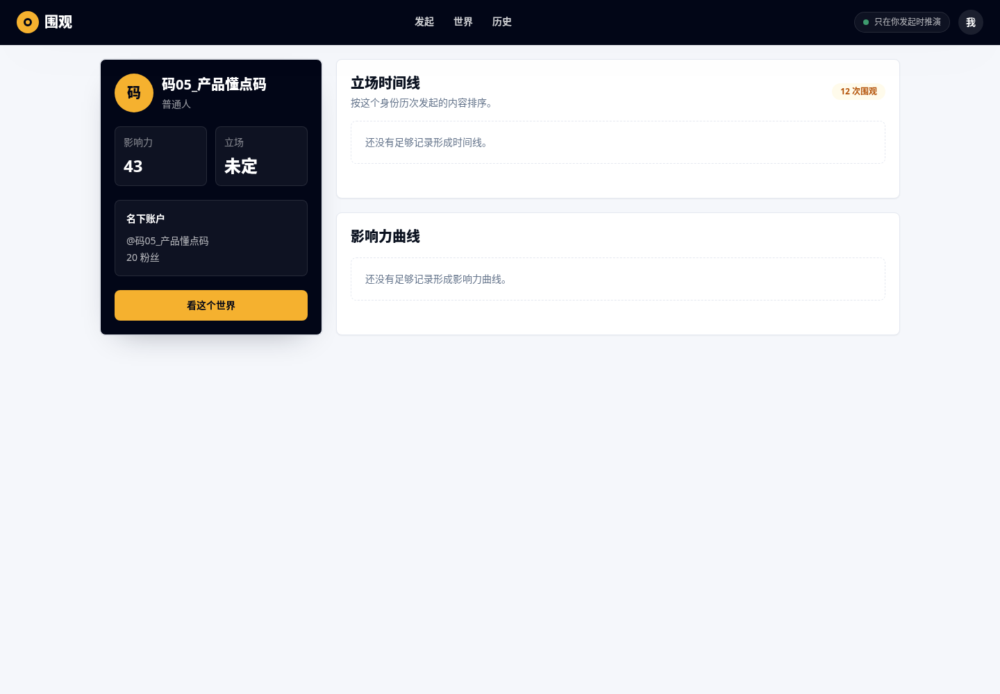

P14 原型图：

- 发起页世界选区：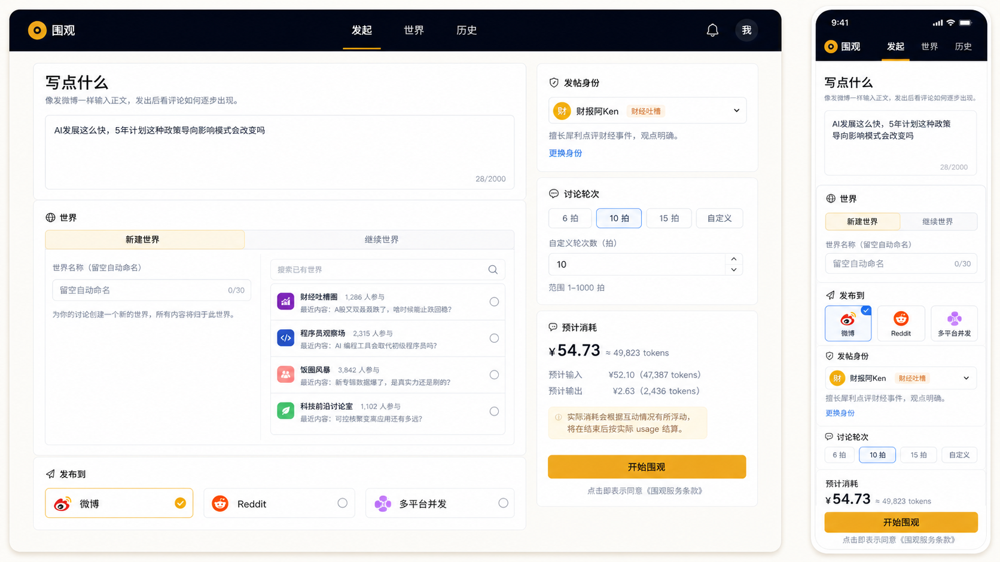
- 世界总览：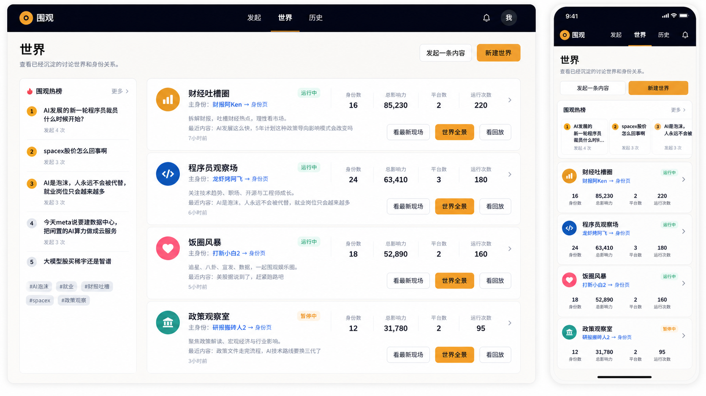
- 身份页到达态：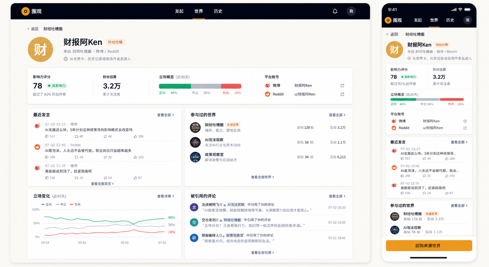
- 世界详情双语义入口：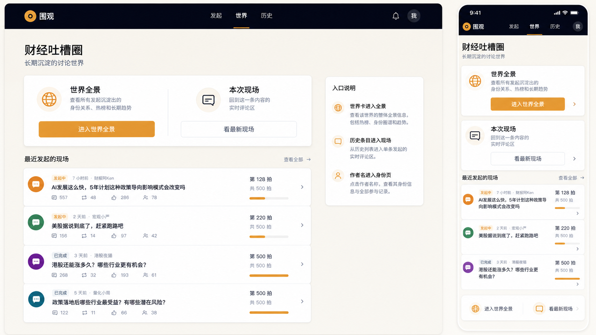

P13 基线原型图：

- 发起页：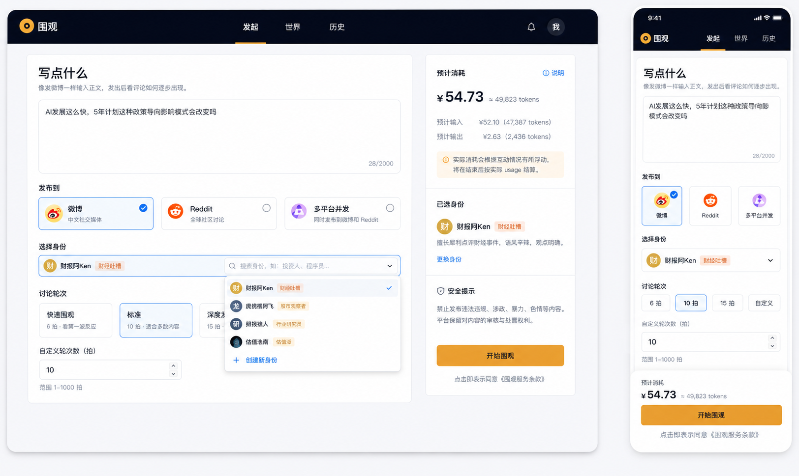
- 统一历史：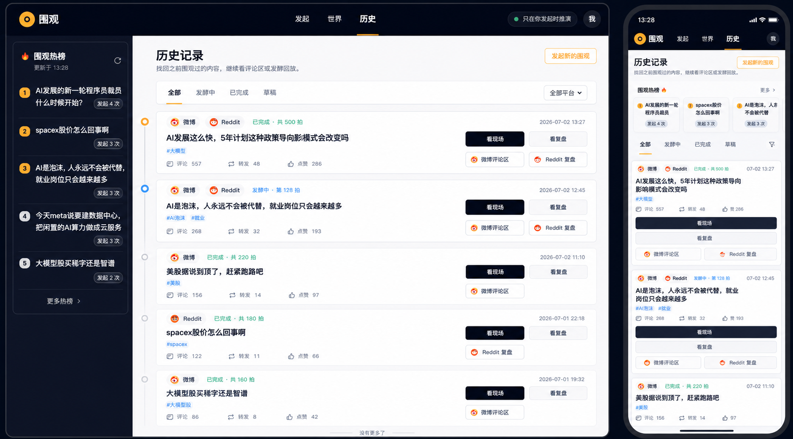
- 多平台现场：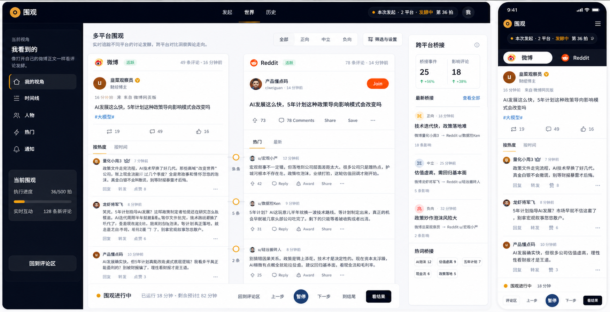
- Launch 复盘：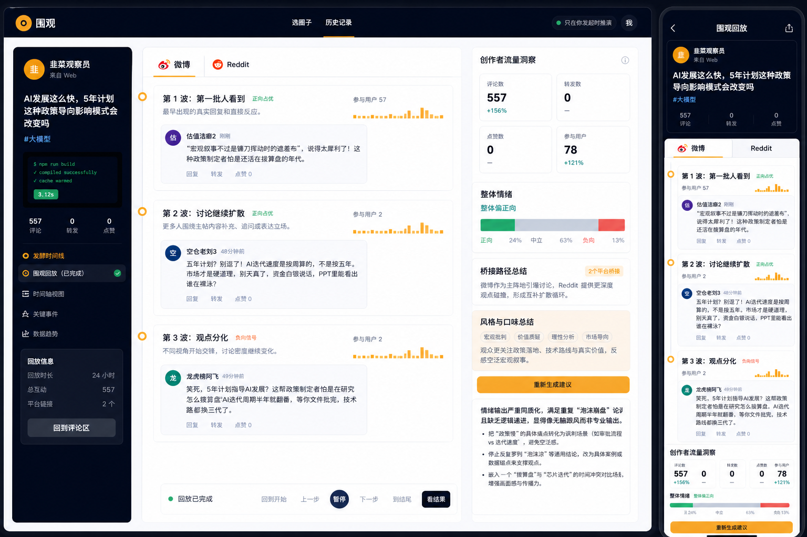

## 5. 页面地图

| 页面 | 路由 | 主要接口 | 最新验收重点 |
| --- | --- | --- | --- |
| 选圈子 | `/` | `/api/crowds`, `/api/runs` | 进入发起页；热榜不显示裸编号 |
| 发起 | `/compose` | `/api/worlds`, `/api/runs/preview-cost`, `/api/identities`, `/api/persons`, `/api/runs`, `/api/multi-runs` | 新建/继续世界；继续列表可搜索窗口化；语义色来自 tokens；成功后跳现场 |
| 世界总览 | `/worlds` | `/api/worlds` | 直接来自世界接口；世界名安全；身份名可进入身份页 |
| 历史 | `/history` | `/api/launches`, `/api/runs`, `/api/worlds/{id}/persons` | 历史作者可进入身份页；回放不新发起 |
| 单平台评论区 | `/run/{id}/live` | `/api/runs/{id}`, `/api/runs/{id}/stream`, `/api/runs/{id}/snapshot?tail=...` | 有归属作者名可进入身份页；评论窗口化 |
| 单平台回放 | `/run/{id}/live?replay=1` | `/api/runs/{id}/snapshot?tail=200` | 只读保存内容；不触发新发起 |
| 单 run 复盘 | `/run/{id}/retro` | `/api/runs/{id}`, `/analysis`, `/retro`, `/insights`, `/flavor` | 建议可持久化；复盘维度清晰 |
| 身份 | `/identity/{person_id}?world_id={world_id}` | `/api/worlds/{id}/persons/{person_id}`, `/api/runs` | 从多入口可到达；页面不展示裸长 ID |
| 多平台现场 | `/world/{id}/live?run_id=...&run_id=...` | `/api/worlds/{id}/events?run_id=...&after=...`, `/api/launches` | 有归属作者名可进入身份页；完成后停止轮询 |
| Launch 复盘 | `/world/{id}/retro?launch={launch_id}` | `/api/launches`, `/api/worlds/{id}/events`, `/api/runs/{id}/analysis`, `/api/runs/{id}/flavor` | 本次发起语义清晰；平台切换可用 |

## 6. 发起页验收

验收步骤：

1. 打开 `/compose`。
2. 输入正文。
3. 选择微博或微博 + Reddit。
4. 选择“新建世界”或“继续世界”。
5. 继续世界列表应可搜索、有限展示，不随历史数量无限铺满页面。
6. 选择发帖身份：普通人、大V、KOL、新身份、继续身份。
7. 选择讨论轮次，或自定义 1-1000 拍。
8. 点击“开始围观”。

预期：

- 前端向 `/api/runs` 或 `/api/multi-runs` 传递 `world_mode/world_name/world_id/person_id` 等必要信息。
- 单平台成功后进入 `/run/{run_id}/live`。
- 多平台成功后进入 `/world/{world_id}/live?run_id=...&run_id=...`。
- 页面按钮在请求中禁用，不重复提交。
- BYOK 区域折叠，不抢首屏注意力。
- 选中态使用 `border-accent bg-accentSoft text-accent`。
- 提示框使用 `border-warnBorder bg-warnSoft text-warnInk`。
- 不再出现 `bg-blue-50` 或 `amber-*` 语义色硬编码。

## 7. 世界总览验收

验收步骤：

1. 打开 `/worlds`。
2. 确认页面调用 `/api/worlds`。
3. 确认每张卡片显示安全世界名、摘要、平台、最近互动和统计。
4. 点击卡片里的主身份名。
5. 确认进入 `/identity/{person_id}?world_id={world_id}`。
6. 点击本次发起入口，确认带 `run_id`。
7. 点击世界全景入口，确认不带 `run_id`。

语义：

- 带 `run_id`：只看本次发起。
- 不带 `run_id`：看这个世界的长期全景。

预期：

- 世界卡片不以 `w_...` 或长 hex 作为标题。
- 主身份名是中文名或确定性化名。
- 没有明确身份归属时，不显示可点击身份入口。

## 8. 历史记录验收

验收步骤：

1. 打开 `/history`。
2. 确认历史按一次发起组织，单平台和多平台都能出现。
3. 点击历史条目的作者名。
4. 确认进入对应身份页。
5. 点击“看评论区”，确认单平台进入 `/run/{id}/live?replay=1`。
6. 点击“看现场”，确认多平台进入 `/world/{id}/live?run_id=...`。
7. 点击“看回放/看结果”，确认进入相应复盘页。

重启验收：

1. 停掉前后端。
2. 使用同一 `WEIGUAN_WORKDIR=/tmp/weiguan-e2e` 重启。
3. 打开 `/history`。

预期：

- 历史仍存在。
- 从历史进入评论区不会新发起。
- 历史条目的状态和统计来自保存数据。
- 作者名不显示裸内部编号。

## 9. 单平台评论区验收

验收步骤：

1. 打开 `/run/{id}/live` 或 `/run/{id}/live?replay=1`。
2. 原帖应尽早显示，评论逐步出现或从历史窗口读取。
3. 评论区内部滚动，不应无限撑高页面。
4. 新评论优先可见，排序符合社交信息流预期。
5. 相对时间基于事件时间显示，不应全部是“刚刚”。
6. 点击原帖作者名或评论作者名。
7. 有明确人物归属时进入身份页；无归属时保留普通视角切换或纯展示。
8. 回放态点击“加载更早评论”，确认追加旧评论且不重复。

接口验收：

```bash
curl -s "http://127.0.0.1:8000/api/runs/$RUN_ID/snapshot?tail=200" \
  | jq '{posts:(.posts|length), replies:(.replies|length), window}'
```

预期：

- 返回 `window`。
- `window.totals` 表示全量统计。
- `replies` 是窗口，不一定等于总评论数。

## 10. 多平台现场验收

验收步骤：

1. 从多平台发起成功页或历史页进入 `/world/{id}/live?run_id=...&run_id=...`。
2. 顶部显示“本次发起”和状态：发酵中 / 已完成 / 已中断。
3. 微博列与 Reddit 列分别展示各自现场。
4. 桥接信息进入文档流或右栏，不使用横跨页面的悬浮 hack。
5. 无桥接时不占据整列空面板。
6. 作者名是中文显示名或确定性化名。
7. 点击有归属的作者名，进入身份页。
8. 完成后轮询停止。
9. 点击“看结果”进入 launch 复盘。

游标接口验收：

```bash
curl -s "http://127.0.0.1:8000/api/worlds/$WORLD_ID/events?run_id=$RUN_ID_1&run_id=$RUN_ID_2&after=0" \
  | jq '{count:(.frames|length), next_after, clock_tick, launch_status}'
```

拿到 `next_after` 后：

```bash
curl -s "http://127.0.0.1:8000/api/worlds/$WORLD_ID/events?run_id=$RUN_ID_1&run_id=$RUN_ID_2&after=$NEXT_AFTER" \
  | jq '{count:(.frames|length), next_after, clock_tick, launch_status}'
```

预期：

- 第二次只返回增量。
- 没有新事件时 `frames` 为空。
- 完成态 `launch_status="done"`。
- `clock_tick` 与页面“第 n 拍”一致。

## 11. 身份页验收

入口清单：

- 顶部“我”。
- 世界总览卡片的主身份名。
- 历史记录条目的作者名。
- 单平台评论区中有归属的作者名。
- 多平台现场中有归属的作者名。

验收步骤：

1. 从上述任一入口进入身份页。
2. loading 应为结构骨架。
3. 页面显示昵称、身份类型、影响力、账户信息。
4. 立场时间线按该身份历次发起展示。
5. 数据不足时显示空态。
6. 返回上一页后上下文仍保持。

显示名要求：

- 数据集前缀应清洗，如 `码05_产品懂点码` 显示为 `产品懂点码`。
- 数字后缀可保留，如 `估值洁癖2`，用于避免撞名。
- 不显示裸 `person_id/account_id/world_id`。

## 12. 复盘验收

单 run 复盘入口：`/run/{id}/retro`。  
Launch 复盘入口：`/world/{world_id}/retro?launch={launch_id}`。

验收步骤：

1. 打开单 run 复盘。
2. 切换传播树、立场分化、影响力榜、情绪时间线、数据趋势。
3. 打开 launch 复盘。
4. 切换微博/Reddit 平台 tab。
5. 查看右侧建议。
6. 点击“重新生成建议”前确认 LLM key 或本地服务可用。
7. 生成建议后刷新页面，确认建议持久化。

预期：

- 空数据显示空态，不伪造图表。
- 建议刷新后不丢失。
- 复盘页不为首屏打开拉全量 snapshot。
- tab 表达业务维度，不是简单情绪过滤。

## 13. 入口接线矩阵

完整审计见 [P14 入口接线审计](2026-07-06-weiguan-P14-wiring-audit.md)。

| 从 | 到 | 当前入口 | 验收方式 |
| --- | --- | --- | --- |
| 发起页 | 世界总览 | 成功发起后世界持久化，可在 `/worlds` 找到 | 新发起后刷新世界页 |
| 世界总览 | 身份页 | 点击主身份名 | 进入 `/identity/{person_id}?world_id={world_id}` |
| 历史记录 | 身份页 | 点击历史作者名 | 进入身份页 |
| 单平台评论区 | 身份页 | 点击有归属作者名 | 有归属时进入身份页；无归属不强造 |
| 多平台现场 | 身份页 | 点击有归属作者名 | 有归属时进入身份页；无归属不强造 |
| 历史记录 | 评论区/复盘 | 看评论区、看现场、看回放、看结果 | 不触发新发起 |
| 多平台现场 | Launch 复盘 | 点击“看结果” | 进入带 launch 的复盘页 |

后续新增页面或入口时，必须在实现计划里补“端到端接线验收”表：入口、目标、数据来源、前端路由、后端接口、空态/错误态、无裸 ID 检查、自动化断言、人工验收步骤。

## 14. 硬规则复查

### 14.1 可见长 ID

静态扫描只能辅助，最终以页面渲染为准：

```bash
cd frontend
rg -n "[0-9a-f]{12,}" src/screens src/components src/skins src/pov
rg -n "w_[0-9a-f]{6,}" src/screens src/components src/skins src/pov
```

允许项：

- 测试 fixture 中的假 ID。
- API 字段名或不可见内部参数。
- 路由参数构造。

不允许项：

- 页面标题、用户名、卡片正文、通知、按钮、热榜、复盘中出现裸长 ID。

### 14.2 心智词表

```bash
cd frontend
rg -n "agent|OASIS|仿真|工作台|后端|模型|微博客|\\b步\\b" src/screens src/components src/shell src/skins
```

处理原则：

- 用户界面系统文案中不应出现这些词。
- 用户自己输入的正文或历史内容可能包含“大模型”等自然内容，不应强行改写。
- 轮次应显示为“拍”。

### 14.3 语义色 token

发起页专项：

```bash
cd frontend
rg -n "bg-(blue|amber|emerald|rose|green|indigo|purple)-[0-9]|text-(blue|amber|emerald|rose|green)-[0-9]|border-(blue|amber)-[0-9]" src/screens/ComposeScreen.tsx
```

预期零命中。

保留豁免：

- `text-slate-*`、`bg-white`、`border-line` 属于中性排版和结构色，可继续使用。
- 用户输入内容中的自然词不作为系统文案问题。

## 15. 性能与接口观察

审核时建议打开浏览器 Network：

- `/api/worlds`：世界总览首屏接口，应快速返回持久化世界摘要。
- `/api/launches`：历史页主接口，不应因实时发起阻塞。
- `/api/worlds/{id}/events?after=...`：多平台现场增量接口，完成后不再持续轮询。
- `/api/runs/{id}/snapshot?tail=200`：单平台回放窗口接口，不应首屏拉完整大 snapshot。
- `/api/worlds/{id}/persons`：身份列表接口，世界页和历史页可用来补显示名。

重点问题：

- 请求 pending 很久但后端已经开始执行，说明生命周期接口仍可能存在阻塞。
- 完成态仍持续轮询，说明前端停止条件失效。
- 页面刷新后历史或建议消失，说明持久化链路断。
- 多平台世界全景会包含该世界历史多次发起；验收单次发起必须使用带 `run_id` 的 URL。

## 16. 设计者审核清单

- [ ] 发起页新建/继续世界清晰，不增加用户理解成本。
- [ ] 发起页选中态和提示框颜色符合 tokens，不回退到 Tailwind 默认语义色阶。
- [ ] 世界总览能解释长期世界和本次发起的区别。
- [ ] 历史页按发起组织，不把单平台/多平台拆得难懂。
- [ ] 作者名入口符合社交产品习惯，不像管理后台链接。
- [ ] 身份页能承接从世界、历史、评论区、多平台现场来的上下文。
- [ ] 无归属作者不强行进入身份页，产品语义自洽。
- [ ] 热榜、通知、评论、复盘中无裸长 ID。
- [ ] 视觉语言和 P13/P14 原型保持一致。
- [ ] 移动端布局没有无限列表挤压首屏的问题。

## 17. 已知边界

- 本手册不执行真实 LLM 验收；需要真实发起时由用户控制 key、成本和本地服务。
- 当前状态截图来自 2026-07-04，P14/P14-T8 变化以原型图、自动化验收和代码接线为准；如需视觉二审，应补一组 2026-07-07 当前截图。
- 身份入口只在有明确人物归属时出现；这是设计选择，不是遗漏。

