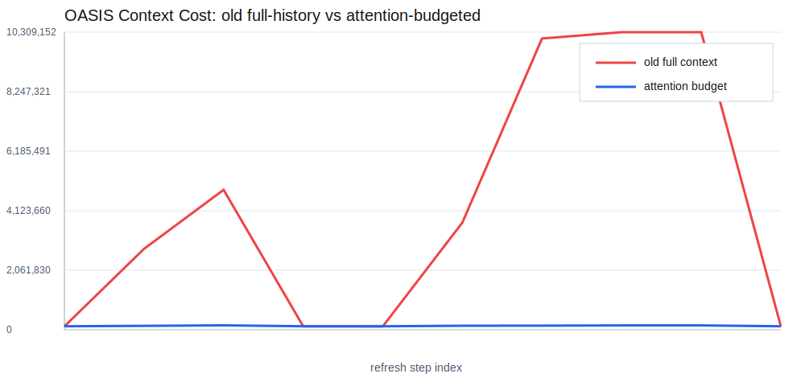

# OASIS 上下文成本估算演练

本报告基于历史 SQLite `run.db` 离线生成，不调用任何 LLM。

## DeepSeek 实际用量

- API 请求数：719
- 总 token：46,297,315
- 输入命中缓存：14,159,232
- 输入未命中缓存：31,824,521
- 输出：313,562
- 估算实际成本：102.72 RMB

## 汇总估算

- 历史数据库中的推荐刷新请求数：560
- 旧全量上下文估算：42,538,328 tokens
- 注意力预算估算：1,338,304 tokens
- 预计降幅：96.85%
- 旧估算与 DeepSeek 实际用量误差：-8.12%
- 注意力估算与 DeepSeek 实际用量差异：-97.11%



## 单次运行

| run.db | 请求数 | 旧算法 tokens | 注意力算法 tokens | 旧算法全未命中 RMB | 注意力算法全未命中 RMB |
|---|---:|---:|---:|---:|---:|
| 1d847f72d572460c9682439c2369e3a9 | 168 | 7,765,296 | 404,217 | 24.49 | 1.27 |
| cf01392bb08645d58a2d9dfa4d80972d | 56 | 116,368 | 119,280 | 0.37 | 0.38 |
| f67df8c372334dbca20644c2ab3dc5ef | 280 | 34,540,296 | 695,527 | 108.93 | 2.19 |
| f8f7e73771de48f7a4e8f47401372db0 | 56 | 116,368 | 119,280 | 0.37 | 0.38 |

## 模型

旧全量上下文成本会随着每次推荐刷新中可见的累计评论继续增长。

```text
旧算法：       Total ~= sum_t A_t * (B + visible_posts_t + all_visible_comments_t)
注意力算法：   Total <= sum_t A_t * (B + seed_panel + bounded_comment_budget)
```

限制评论上下文后，历史评论数量只影响确定性面板统计和候选选择，不再直接撑大 prompt。
